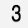

it's hard to find any document about how to use the trained model of MNIST in caffe project.

so I wrote this.if it helps you. pls give me a star or msg.thanks!

2017-03-22 in China.ShenZhen.

by 9crk

